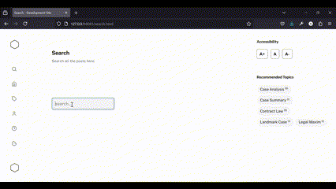
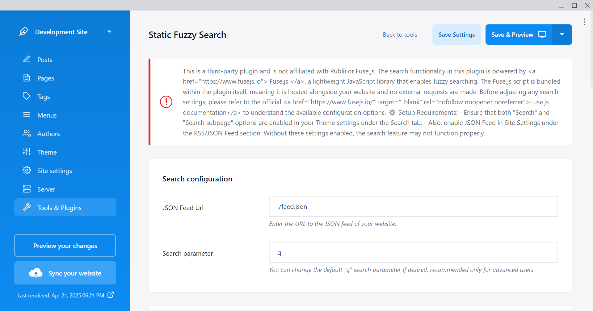

# Publii Static Fuzzy Search Plugin

A third-party plugin that adds **fuzzy search functionality** to [Publii](https://getpublii.com) static sites using the powerful [Fuse.js](https://fusejs.io) JavaScript library.

> ⚠️ This plugin is not affiliated with Publii or Fuse.js.


## Features

- 🚀 Lightweight, client-side fuzzy search
- 🔎 Searches across post titles, summaries, and tags
- 📂 Works with a static JSON feed (no backend required)
- 📡 No external requests – Fuse.js is bundled locally
- 🖍 Optional result highlighting for matched keywords
- 🔗 Search term stays in the URL for easy sharing

## Demo

Here’s how the live fuzzy search works:



## Images

Here’s how the live fuzzy search works:




## Installation

You can install the plugin using either of the following methods:

### Option 1: Install via Publii UI (Recommended)

1. Download the plugin ZIP from this GitHub repository.
2. Open the **Publii** app and go to **Plugins** → **Add new**.
3. Select the downloaded ZIP file.
4. Activate the plugin once installed.

### Option 2: Manual Installation

1. Download the plugin ZIP from this GitHub repository.
2. **Unzip** the file.
3. Copy the entire `static-custom-search` folder into your Publii site's `input/plugins` directory.
4. Open the **Publii** app, go to the **Plugins** section, and enable **Static Custom Search**.


## ⚙️ Requirements

To use the plugin, you must enable the following settings in your Publii site:

### In **Theme Settings** → **Search**:
- ✅ Enable `Search`
- ✅ Enable `Search Subpage`

### In **Site Settings** → **RSS/JSON Feed**:
- ✅ Enable `JSON Feed`

Without these, the plugin will not function.


## 🧠 How It Works

- The plugin fetches your static JSON feed (`feed.json`)
- It indexes post data with Fuse.js using options like:
  - `title`, `summary`, `tags`
  - fuzzy matching with diacritic support, score sorting, and extended search
- Input is matched live and results are displayed immediately
- URL is updated in real time for deep-linking/search-sharing
- Matched text is highlighted using `<mark>` tags


## Example Output

```html
<h5><a href="/post-url">Matching Post Title</a></h5>
<p>This is a matching summary with <mark>highlighted</mark> terms.</p>
```

If you encounter any issues or have any questions, please feel free to open an issue in this repository.

## License
This plugin is released under the GPL-3.0 license.